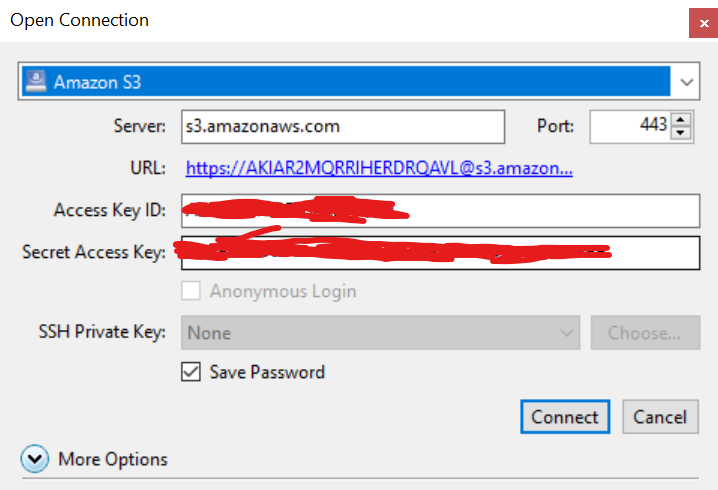

## Cyberduck

### Prerequisites

- [Cyberduck](https://cyberduck.io/download/)

### Table Of Contents

- [Connect to AWS S3](#connect-to-aws-s3)

### Connect to AWS S3

1. Install and Open **Cyberduck**.

2. After open the application, click on **Open Connection**.

3. Click Dropdown Options **FTP (File Transfer Protocol)** and choose **Amazon S3**.

4. Fill the credentials needed above.

5. Click **Connect**, and now you are connected if your credentials was right.

