## Postman Best Practice

### Prerequisites

- Postman v8

### Table Of Contents
- [Setting up environment](#setting-up-environment)
    - [Setting up environment automation](#setting-up-environment-automation)

### Setting up environment

Before follow the guide below, make sure you had follow the prerequisites and open the **Postman** desktop app.

1. Click on the environments tab.

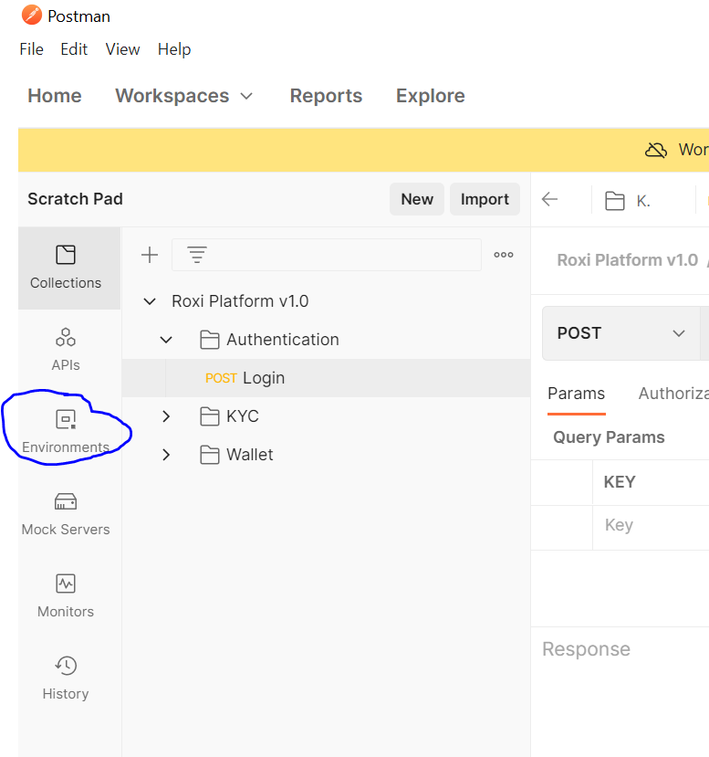

2. Click on the `plus/+` icon to create new environment.

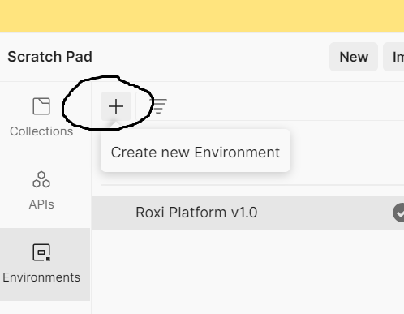

3. If you already create the new environment lets start with creating a variable named `token` for it. (just fill the input it will do auto-save)\

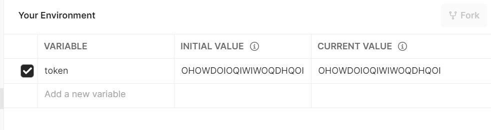

#### Setting up environment automation

If you already understand how to made an environment and variable in it. Lets move to create an automation for your variables environments.

1. Click the collections tab.

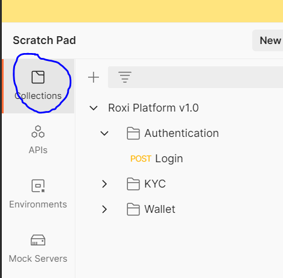

2. Click on the `plus/+` icon to create new collection.

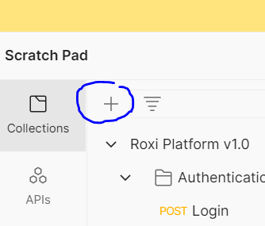

3. If you already create the new collection, lets start with creating new folder in it.

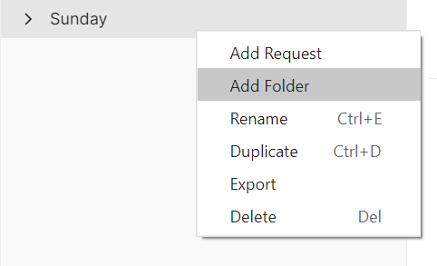

4. Then, create new request in it.

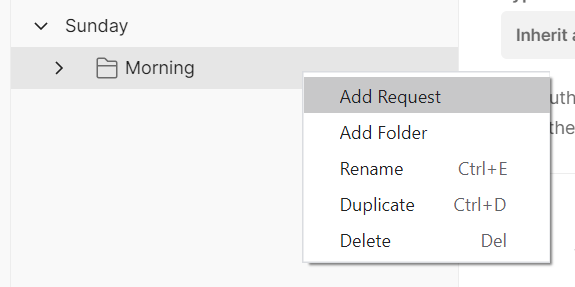

5. after set up your request, lets start with an automation for your API response, you can use your own API for the next steps, for example, i will use my project login API to do the job.

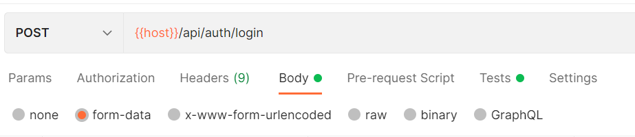

6. as you can see, this is my project login API response, the token is the first "key: value" pair in the object.

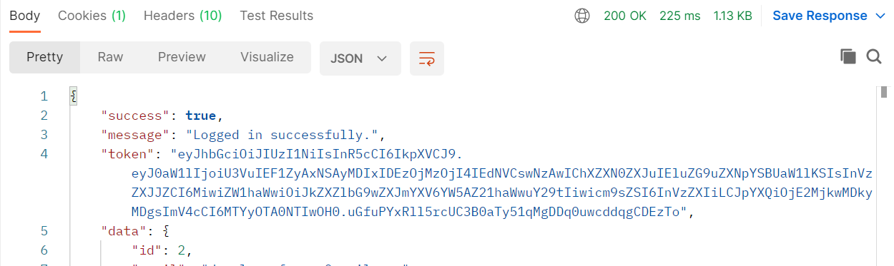

7. lets create the automation, click the tests tab under your request URL.

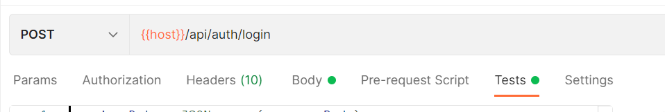

8. after that, lets write the automation script for the login API response to get the token response.

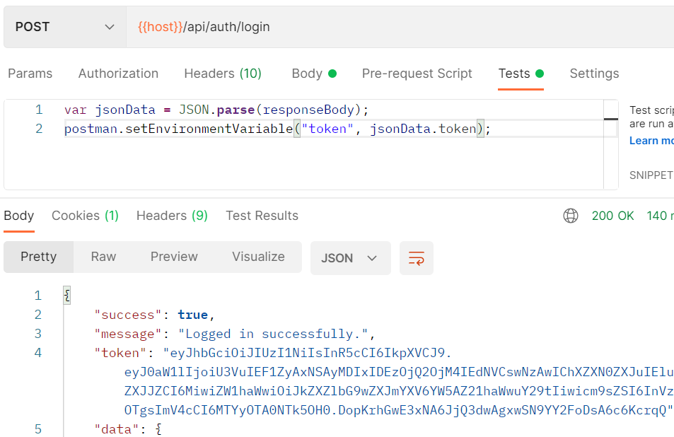

example script :
```js
var jsonData = JSON.parse(responseBody);
postman.setEnvironmentVariable("token", jsonData.token);
```

9. lets move to your previously created environment, now your token was automically filled with the token response.

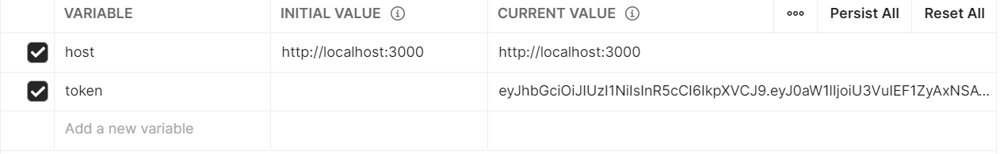
